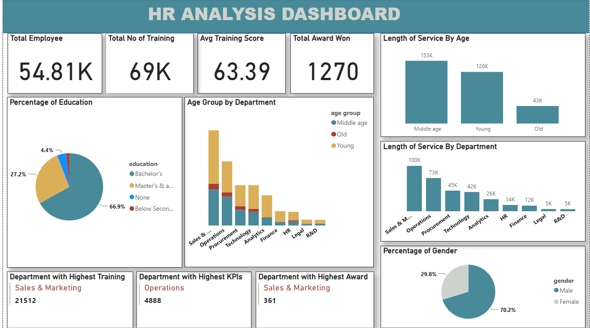

# HR-dataset-Analysis

This is a project on data cleaning using power query and Power BI for visualization. 
Interact with the dashboard [here](https://app.powerbi.com/groups/me/reports/cda88d77-bab5-441d-b834-30beaa15f4da/ReportSection?experience=power-bi)

## Project Objective
The purpose was to solve the following insights
1.  Total Employees
2.  Percentage of gender
3.  Percentage of Education
4.  Total  number of Trainings
5.  Department with highest Training
6.  Average Training Score
7.  Department with with the Highest KPI
8.  Age Grouping by Department
9.  Total Award Won
10. Department with Highest Award
11. Length of Service Grouping by Age 
12. Length of Service Grouping by Department

## Data Transformation
Data cleaning was done using Power Query Editor.
Duplicates were removed, and Null values replaces as needed

## Findings
Analysis shows a total number of 54.81 thousand employees with more Males than Female and a larger percentage has atleast a Bacherlor's dregre. 
A large proportion of the employees are in Sales and Marketing.

